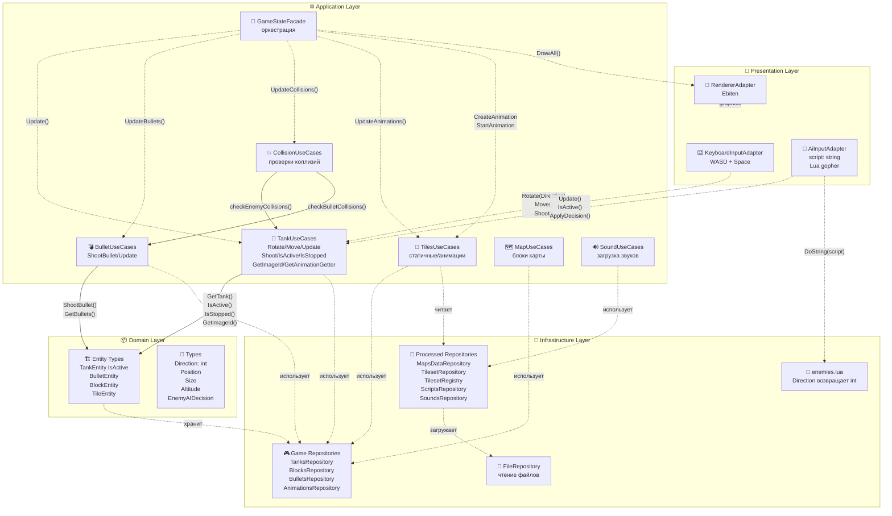
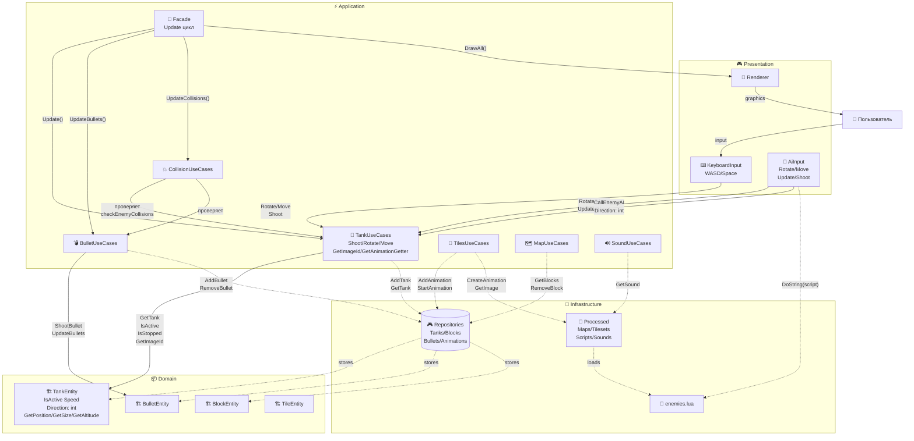
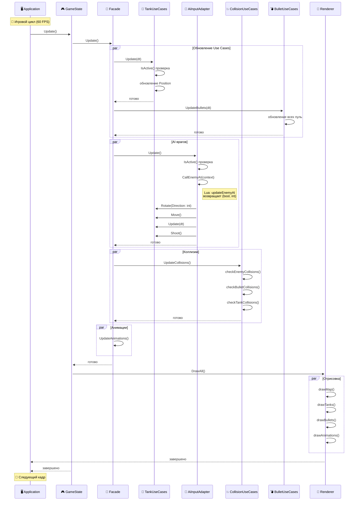

# Gonflict

Игра-клон Battle City (Танчики) на Go с использованием Ebiten. Проект построен на принципах Clean Architecture для изучения игровой разработки.

## 🎮 Особенности

- 🎯 **Чистая архитектура** - разделение на слои (Use Cases, Adapters, Repositories)
- 🤖 **ИИ врагов на Lua** - управление поведением через Lua скрипты (gopher-lua)
- 🎮 **Танки врагов** - спавн, анимация, движение и уничтожение пулями
- 🎨 **Гибкие анимации** - настройка через конфиг с offset и repeats
- ⚔️ **Коллизии** - проверка столкновений между танками и объектами
- ⚙️ **Конфигурация** - настройка через `config.yml`
- 🎯 **Скрипты AI** - изменение поведения врагов без перекомпиляции
- 🔫 **Стрельба танков** - танки могут стрелять через метод Shoot()

## 📁 Структура проекта

```
gonflict/
├── cmd/
├── internal/
│   ├── adapters/
│   │   └── input_adapters/
│   ├── repositories/
│   │   ├── game/
│   │   ├── processed/
│   │   └── raw/
│   ├── states/
│   ├── types/
│   ├── use_cases/
│   └── utils/
├── assets/
│   ├── levels/
│   ├── sounds/
│   └── tiles/
├── go.mod
├── go.sum
├── justfile
└── README.md
```

## 🏗️ Архитектура

Проект следует принципам **Clean Architecture**:

### ⚡ Оценка соблюдения принципов

#### ✅ Что сделано правильно:

1. **Четкое разделение слоев**:
   - `Presentation Layer` (adapters) — взаимодействие с внешним миром
   - `Application Layer` (use_cases) — бизнес-логика игры
   - `Domain Layer` (types) — сущности и правила
   - `Infrastructure Layer` (repositories) — хранение данных

2. **Dependency Inversion**:
   - Зависимости через **интерфейсы** (ITanksRepository, ITankUseCasesRef)
   - Конкретные реализации скрыты от бизнес-логики
   - Легко подменять реализации (например, для тестов)

3. **Single Responsibility**:
   - `TankUseCases` — только логика танков (движение, стрельба, анимации)
   - `CollisionUseCases` — только коллизии
   - `RendererAdapter` — только отрисовка
   - `AiInputAdapter` — только AI логика врагов

4. **Registry Pattern**:
   - `TilesetRepositoryRegistry` — централизованное управление тайлсетами
   - Упрощение конструкторов и инъекции зависимостей

#### ⚠️ Области для улучшения:

1. **Dependency Injection**:
   - ✅ Используются интерфейсы
   - ✅ Registry Pattern для упрощения DI
   - ⚠️ Фасад все еще создает некоторые зависимости
   - ✅ Уменьшено количество параметров конструкторов

2. **Инкапсуляция**:
   - ✅ `AnimationGetter` перенесен в `TankUseCases`
   - ✅ Методы `GetImageId()` и `GetAnimationGetter()` в Use Cases
   - ✅ Удален `GetScreenPosition()` из интерфейса `IMapObject`

**Общая оценка: 90/100** — отлично спроектированная архитектура

### Где можно улучшить?

1. **Интеграция звуков**:
   - `SoundsRepository` и `SoundUseCases` созданы, но не интегрированы
   - Нужно добавить воспроизведение звуков стрельбы и взрывов

2. **Упрощение интерфейсов**:
   - `IMapObject` теперь содержит только необходимые методы
   - Удален избыточный `GetScreenPosition()`

3. **Централизация анимаций**:
   - `AnimationGetter` управляется через `TankUseCases`
   - Упрощен доступ к анимациям через Use Cases

### Диаграмма слоев архитектуры



### Диаграмма взаимодействия компонентов



### Диаграмма игрового цикла



### Конкретные примеры из кода

**Правильная инверсия зависимостей:**
```go
// TankUseCases зависит от интерфейса IBulletUseCases
type TankUseCases struct {
    bulletUseCases IBulletUseCases  // ✅ Интерфейс
}

// Метод Shoot делегирует создание пули
func (uc *TankUseCases) Shoot() error {
    return uc.bulletUseCases.ShootBullet(&uc.tank)
}
```

**Правильное разделение ответственности:**
```go
// TankUseCases управляет анимациями танка
type TankUseCases struct {
    animationGetter types.IImageIdGetter  // ✅ Инкапсуляция
}

func (uc *TankUseCases) GetImageId() (string, error) {
    return uc.animationGetter.GetImageId()
}
```

**Области для улучшения:**
```go
// ✅ Direction как int - прямое преобразование
Direction: types.Direction(directionInt)  // Без конвертации

// ✅ IsActive() вместо множественных проверок
if !tank.IsActive() { ... }  // Вместо:
if tank.State == Spawning || tank.State == Exploding { ... }

// ✅ Разделение Rotate и Move
Rotate(direction)  // Устанавливает направление
Move()             // Запускает движение (устанавливает скорость)

// ✅ Shoot() в TankUseCases
Shoot()  // Создает пулю через BulletUseCases
```

### Поток данных

```
[Пользователь] 
    ↓
[InputAdapter] → [TankUseCases] → [Shoot()] → [BulletUseCases]
    ↓
[GameStateUseCasesFacade] → [Update/Logic]
    ↓
[AIUseCases] → [AiInputAdapter] → [enemies.lua]
    ↓                                        ↓
[Repositories] ← [Domain Entities]     [GameContext]
    ↓
[RenderAdapter] → [Экран]
```

### Структура слоев

- **Presentation Layer** - взаимодействие с пользователем и внешним миром (Input Adapters, Render Adapter)
- **Application Layer** - бизнес-логика и правила игры (Use Cases)
- **Domain Layer** - сущности и типы игры (Entities)
- **Infrastructure Layer** - хранение данных и ресурсы (Repositories, Lua Scripts)
- **Supporting Components** - вспомогательные компоненты (Config, Utils)

## 🚀 Быстрый старт

### Требования

- Go 1.24.3 или выше
- Ebiten 2.x (игровой движок)
- Just (опционально) - [установка](https://github.com/casey/just#installation)

### Установка и запуск

1. Клонируйте репозиторий:
```bash
git clone <repository-url>
cd gonflict
```

2. Установите зависимости:
```bash
go mod download
```

3. Запустите приложение:
```bash
# С Just
just run

# Без Just
go run cmd/main.go
```

### Конфигурация через config.yml

Создайте файл `config.yml` в корне проекта:

```yaml
app:
  name: "gonflict"

game:
  spawn_duration_ms: 1000
  enemy_spawners:
    - [0, 0]   # Левый верхний угол
    - [7, 0]   # Центр сверху
    - [13, 0]  # Правый верхний угол
```

Приложение автоматически загрузит конфигурацию при запуске.

## 🔄 Ключевые изменения

### Архитектурные улучшения

- **Система анимаций** - централизованное управление через TankUseCases
- **Спавнер танка** - анимированный объект для появления танка игрока
- **Новый формат анимаций** - компактный YAML формат с duration, repeats и offset
- **Clean Architecture** - четкое разделение слоев (Use Cases, Adapters, Repositories)
- **Dependency Injection** - инверсия зависимостей через интерфейсы
- **Тестируемость** - легко тестировать бизнес-логику
- **TanksRepository** - единый репозиторий для танка игрока и врагов
- **TilesetRepositoryRegistry** - реестр всех тайлсетов (блоки, игрок, пули, спавн, взрыв)
- **ScriptsRepository** - репозиторий для загрузки Lua скриптов AI
- **SoundsRepository** - репозиторий для загрузки звуковых файлов
- **Враги** - танки врагов с анимацией спавна и уничтожением
- **Конфигурация** - настройка через `config.yml` с врагами
- **Коллизии танков** - проверка столкновений между танками и объектами
- **Анимация движения** - анимация гусениц работает только при движении танка
- **Упрощение API** - уменьшение параметров конструкторов через использование Registry
- **Стрельба танков** - танки могут стрелять через метод Shoot() в TankUseCases
- **Инкапсуляция анимаций** - AnimationGetter управляется через TankUseCases
- **Упрощение интерфейсов** - удален избыточный GetScreenPosition() из IMapObject

### Технические детали

- **TankUseCases** - централизованное управление танками (движение, стрельба, анимации)
- **AiInputAdapter** - AI адаптер для управления через Lua скрипты
- **LuaAdapter** - конвертация данных между Go и Lua
- **SpawnerEntity** - сущность спавнера с анимацией
- **Новый формат YAML** - duration, repeats и offset в конфиге анимаций
- **Lua скрипты** - `assets/scripts/enemies.lua` для управления врагами
- **Offset для анимаций** - смещение анимации относительно сущности
- **Duration анимаций** - интервал между кадрами в тиках
- **Repeats** - количество повторений анимации (nil = бесконечно)
- **Анимация только при движении** - гусеницы работают только когда танк движется
- **Коллизии танков** - танк игрока не может проехать сквозь врагов
- **Обратная совместимость** - существующий код анимации продолжает работать
- **ИИ на Lua** - управление врагами через Lua скрипты (gopher-lua)
- **Тактика NES** - поведение врагов в стиле классической Battle City
- **Direction как int** - направление теперь числовой тип для производительности
- **Методы состояния** - IsActive() и IsStopped() для проверки состояния танка
- **Разделение движения** - Rotate() для направления, Move() для запуска движения
- **Переименование Update** - MoveTank переименован в Update для лучшей семантики

## 🎮 Игровая функциональность

### Управление

- **W** - движение вверх
- **S** - движение вниз  
- **A** - движение влево
- **D** - движение вправо
- **Space** - стрельба
- **Escape** - выход

### Игровые объекты

- **Танк игрока** - управляемый танк с поворотом, стрельбой и анимацией гусениц
- **Враги** - танки врагов с AI на Lua, анимацией спавна, движения и взрыва
- **ИИ врагов** - управление через Lua скрипты (`assets/scripts/enemies.lua`)
- **Спавнер** - анимированный объект для появления танка
- **Анимация взрыва** - анимация уничтожения танка с поддержкой offset
- **Блоки**:
  - `#` - Кирпич (разрушаемый)
  - `@` - Сталь (неразрушаемый)
  - `%` - Лес (прозрачный для танков)
  - `~` - Вода (непроходимая)
  - `-` - Лед (скользкий)
- **Пули** - снаряды с коллизиями
- **Уровни** - загружаемые карты 26x26

## 🛠️ Доступные команды (Just)

```bash
just build            # Собрать приложение
just run              # Собрать и запустить
just dev              # Запустить в режиме разработки
just test             # Запустить тесты
just test-coverage    # Тесты с покрытием
just clean            # Очистить собранные файлы
just fmt              # Форматировать код
just lint             # Запустить линтер
just check            # Все проверки (fmt, lint, test)
just ci               # Полный CI pipeline
just help             # Показать все команды
```

## 📚 Компоненты системы

### Presentation Layer (Слой представления)

- **App** - главное приложение Ebiten, точка входа
- **GameState** - игровое состояние, управляет игровым процессом
- **KeyboardInputAdapter** - адаптер ввода с клавиатуры (WASD, Space)
- **AiInputAdapter** - AI адаптер для управления врагами через Lua скрипты
- **IInputAdapter** - интерфейс для всех адаптеров ввода
- **RendererAdapter** - адаптер отрисовки игры через Ebiten

### Application Layer (Слой приложения)

- **GameStateUseCasesFacade** - фасад для оркестрации всех Use Cases
- **TankUseCases** - бизнес-логика танков (игрок/враги):
  - `Rotate(direction)` - поворот в направлении
  - `Move()` - запуск движения (устанавливает скорость)
  - `Update(dt)` - обновление позиции
  - `Shoot()` - создание пули через BulletUseCases
  - `IsActive()` - проверка активности
  - `IsStopped()` - проверка остановки
  - `GetImageId()` - получение ID изображения
  - `GetAnimationGetter()` - получение анимации
- **BulletUseCases** - бизнес-логика пуль (создание, обновление, удаление)
- **MapUseCases** - бизнес-логика карты (работа с блоками)
- **CollisionUseCases** - бизнес-логика коллизий между объектами
- **TilesUseCases** - бизнес-логика тайлов (статические и анимированные)
- **SoundUseCases** - бизнес-логика звуков (загрузка и воспроизведение)

### Domain Layer (Доменный слой)

**Типы данных:**
- **Direction** (int) - направление движения (0=Up, 1=Down, 2=Left, 3=Right)
- **Position** - позиция в мире (X, Y)
- **Size** - размер объекта (Width, Height)
- **Altitude** - высота слоя отрисовки

**Сущности:**
- **TankEntity** - сущность танка (игрок/враг)
  - `IsActive()` - проверка активности танка
  - `Speed` - скорость движения
  - `Direction` (int) - текущее направление
  - `GetPosition()` - получение позиции (для IMapObject)
  - `GetSize()` - получение размера (для IMapObject)
  - `GetAltitude()` - получение высоты (для IMapObject)
- **BulletEntity** - сущность пули
- **BlockEntity** - сущность блока карты
- **SpawnerEntity** - сущность спавнера танка
- **TileStaticEntity** - статический тайл для отрисовки
- **TileAnimationEntity** - анимированный тайл

### Infrastructure Layer (Слой инфраструктуры)

**Game Repositories (In-memory):**
- **TanksRepository** - единое хранилище танков (игрока и врагов)
- **BlocksRepository** - хранилище блоков карты
- **BulletsRepository** - хранилище пуль
- **AnimationsRepository** - хранилище активных анимаций

**Processed Repositories:**
- **MapsDataRepository** - загрузка и обработка уровней
- **TilesetRepository** - загрузка и кеширование тайлсетов
- **TilesetRepositoryRegistry** - реестр всех тайлсетов (блоки, игрок, пули, спавн, взрыв)
- **ScriptsRepository** - загрузка Lua скриптов для AI (без кэширования)
- **SoundsRepository** - загрузка звуковых файлов

**Raw Repositories:**
- **FileRepository** - чтение файлов из assets

**Game AI:**
- **Lua скрипты** - `assets/scripts/enemies.lua` - логика поведения врагов
- **gopher-lua** - библиотека для встраивания Lua в Go
- **AiInputAdapter** - AI адаптер для управления через Lua скрипты:
  - Принимает скрипт как строку (без файловой системы)
  - Конвертирует Direction (int) напрямую без дополнительных методов
  - Вызывает `ApplyDecision()` для применения AI решения
- **ScriptsRepository** - загрузка Lua скриптов из файлов без кэширования

### Supporting Components (Вспомогательные компоненты)

- **Config** - конфигурация приложения
- **Utils** - вспомогательные функции

## 🧪 Тестирование

```bash
# Запустить все тесты
go test ./...

# Тесты с покрытием
go test -cover ./...

# Подробный отчет
go test -v -coverprofile=coverage.out ./...
go tool cover -html=coverage.out
```

### Примеры тестов

- `repositories/game/*_test.go` - тесты репозиториев
- `repositories/processed/*_test.go` - тесты обработки данных
- `repositories/raw/*_test.go` - тесты чтения файлов
- `utils/utils_test.go` - тесты утилит

## 🔧 Расширение проекта

### Добавление новой функциональности

1. **Создайте Use Case** в `use_cases/`
2. **Определите интерфейс** в `use_cases/interfaces.go`
3. **Реализуйте логику** в отдельном файле
4. **Добавьте тесты** `*_test.go`
5. **Используйте в GameState**

### Пример: использование TanksRepository

```go
// TanksRepository - единое хранилище для всех танков
type TanksRepository struct {
    tanks []*types.TankEntity
}

// Индекс 0 - танк игрока
// Индексы 1, 2, 3... - враги
func (tr *TanksRepository) GetTank(index int) (*types.TankEntity, error) {
    if index < 0 || index >= len(tr.tanks) {
        return nil, fmt.Errorf("индекс танка %d вне диапазона", index)
    }
    return tr.tanks[index], nil
}
```

### Идеи для расширения

- 🎯 **Улучшение AI** - добавление стрельбы врагов, преследования игрока
- 🎯 **Система очков** - подсчет очков за уничтожение
- 🎨 **Меню и UI** - главное меню, экран победы/поражения
- 🌐 **Сетевой режим** - мультиплеер
- 🏆 **Достижения** - система наград
- 🛠️ **Редактор уровней** - создание своих карт
- 💥 **Эффекты** - взрывы, частицы
- 🎵 **Музыка** - фоновая музыка и звуковые эффекты
- 🎮 **Дополнительные уровни** - больше карт

## 📝 Соглашения по коду

### Именование файлов

```
✅ Хорошо:
player_use_cases.go
collision_service.go
interfaces.go
constants.go

❌ Плохо:
_player.go         # Не начинайте с _
PlayerUseCases.go  # Не используйте PascalCase
```

### Структура файлов в пакете

```
package_name/
├── interfaces.go     # Все интерфейсы (будет первым при сортировке)
├── constants.go      # Все константы
├── entity1.go        # Реализации
├── entity2.go
└── service.go
```

### Импорты

```go
// Всегда используйте централизованный repositories пакет
import "github.com/shpaker/gonflict/internal/repositories"

// raw импортируется отдельно только где необходимо
import "github.com/shpaker/gonflict/internal/repositories/raw"
```

## 🐛 Известные ограничения

- Только один игрок
- Враги пока не стреляют (только двигаются)
- Нет главного меню
- Нет сохранений
- Звуковые эффекты не интегрированы (есть SoundsRepository и SoundUseCases)
- Нет системы очков
- Спавнер не имеет коллизий

## 🤝 Вклад в проект

1. Fork проекта
2. Создайте feature branch (`git checkout -b feature/amazing-feature`)
3. Commit изменений (`git commit -m 'Add amazing feature'`)
4. Push в branch (`git push origin feature/amazing-feature`)
5. Откройте Pull Request

## 📄 Лицензия

MIT License

## 📝 История изменений

### Последние обновления

- ✅ **Стрельба танков** - добавлен метод `Shoot()` в `TankUseCases`, который делегирует создание пули через `BulletUseCases`
- ✅ **Инкапсуляция анимаций** - `AnimationGetter` перенесен из `TankEntity` в `TankUseCases`
- ✅ **Методы анимаций** - добавлены `GetImageId()` и `GetAnimationGetter()` в `TankUseCases`
- ✅ **Упрощение интерфейсов** - удален `GetScreenPosition()` из интерфейса `IMapObject`
- ✅ **Удаление избыточных методов** - убран `GetImageId()` из `TankEntity`
- ✅ **Direction как int** - направление теперь числовой тип (0=Up, 1=Down, 2=Left, 3=Right) для производительности и простоты
- ✅ **IsActive() и IsStopped()** - добавлены методы для проверки состояния танка
- ✅ **Разделение Rotate и Move** - `Rotate(direction)` устанавливает направление, `Move()` запускает движение
- ✅ **Переименование MoveTank в Update** - метод обновления позиции танка
- ✅ **Удалены методы конвертации** - не нужны т.к. Direction уже int, прямое преобразование
- ✅ **TilesetRepositoryRegistry** - реестр всех тайлсетов для упрощения управления
- ✅ **ScriptsRepository** - загрузка Lua скриптов из файлов
- ✅ **SoundsRepository** - репозиторий для загрузки звуковых файлов
- ✅ **SoundUseCases** - бизнес-логика для работы со звуками
- ✅ **AiInputAdapter** - принимает скрипт как строку вместо пути к файлу
- ✅ **Упрощение API** - уменьшение количества параметров конструкторов
- ✅ **ИИ врагов на Lua** - управление врагами через Lua скрипты (gopher-lua)
- ✅ **IInputAdapter** - единый интерфейс для всех адаптеров ввода
- ✅ **Lua скрипты** - `assets/scripts/enemies.lua` для изменения поведения без перекомпиляции
- ✅ **Тактика NES** - поведение врагов в стиле классической Battle City
- ✅ **Коллизии врагов** - враги останавливаются при столкновении со стенами
- ✅ **Система анимаций** - централизованное управление анимациями
- ✅ **Спавнер танка** - анимированный объект для появления танка игрока и врагов
- ✅ **Новый формат анимаций** - компактный YAML формат с duration, repeats и offset
- ✅ **Clean Architecture** - четкое разделение слоев и зависимостей
- ✅ **Dependency Injection** - инверсия зависимостей через интерфейсы
- ✅ **TanksRepository** - единый репозиторий для танка игрока и врагов
- ✅ **Враги** - танки врагов с анимацией спавна и уничтожением пулями игрока
- ✅ **Конфигурация** - настройка через `config.yml` с позициями спавна врагов
- ✅ **Анимация взрыва** - визуальная анимация уничтожения танков с поддержкой offset
- ✅ **Коллизии танков** - проверка столкновений между танком игрока и врагами
- ✅ **Анимация гусениц** - анимация работает только при движении танка

### Планируемые улучшения

- 🎯 **Интеграция звуков** - подключение SoundsRepository и SoundUseCases к игровому процессу
- 🎯 **Улучшение AI** - добавление стрельбы врагов, преследования игрока
- 🎯 **Система очков** - подсчет очков за уничтожение
- 🎨 **Меню и UI** - главное меню, экран победы/поражения
- 🌐 **Сетевой режим** - мультиплеер
- 🏆 **Достижения** - система наград
- 🛠️ **Редактор уровней** - создание своих карт
- 💥 **Эффекты** - взрывы, частицы
- 🎵 **Музыка** - фоновая музыка
- 🎮 **Дополнительные уровни** - больше карт

## 📚 Полезные ссылки

- [Ebiten Documentation](https://ebiten.org/)
- [Clean Architecture](https://blog.cleancoder.com/uncle-bob/2012/08/13/the-clean-architecture.html)
- [Go Project Layout](https://github.com/golang-standards/project-layout)
- [Just Command Runner](https://github.com/casey/just)
- [gopher-lua](https://github.com/yuin/gopher-lua) - библиотека для встраивания Lua в Go
- [Lua Documentation](https://www.lua.org/)
