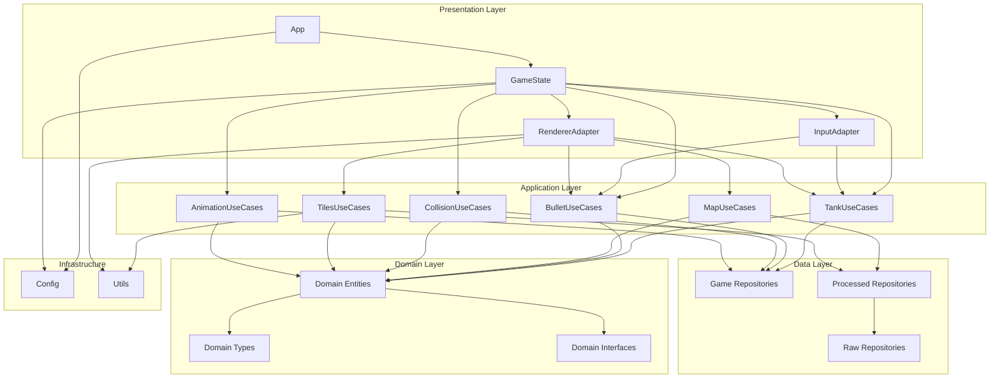

# Gonflict

Игра-клон Battle City (Танчики) на Go с использованием Ebiten. Проект построен на принципах Clean Architecture для изучения игровой разработки.

## 🎮 Особенности

- ✅ **Clean Architecture** - четкое разделение слоев (Use Cases, Adapters, Repositories)
- ✅ **Dependency Injection** - инверсия зависимостей через интерфейсы
- ✅ **Тестируемость** - легко тестировать бизнес-логику
- ✅ **Расширяемость** - простое добавление новых функций
- ✅ **Конфигурируемость** - настройка через переменные окружения
- ✅ **Модульная архитектура** - отдельные адаптеры для разных типов ресурсов
- ✅ **Поворот изображений** - динамический поворот спрайтов по направлению

## 📁 Структура проекта

```
gonflict/
├── cmd/
├── internal/
│   ├── adapters/
│   ├── repositories/
│   │   ├── game/
│   │   ├── processed/
│   │   └── raw/
│   ├── states/
│   ├── types/
│   ├── use_cases/
│   └── utils/
├── assets/
│   ├── levels/
│   ├── sounds/
│   └── new/
├── go.mod
├── go.sum
├── justfile
└── README.md
```

## 🏗️ Архитектура

Проект следует принципам **Clean Architecture**:

### High-Level Design (HLD)



### Принципы

1. **Dependency Rule** - зависимости направлены внутрь (к бизнес-логике)
2. **Interface Segregation** - интерфейсы определяются там, где используются
3. **Dependency Inversion** - зависимость от абстракций, а не реализаций
4. **Single Responsibility** - каждый компонент отвечает за одну задачу

## 🚀 Быстрый старт

### Требования

- Go 1.24.3 или выше
- Ebiten 2.x (игровой движок)
- Just (опционально) - [установка](https://github.com/casey/just#installation)

### Установка и запуск

1. Клонируйте репозиторий:
```bash
git clone <repository-url>
cd gonflict
```

2. Установите зависимости:
```bash
go mod download
```

3. Запустите приложение:
```bash
# С Just
just run

# Без Just
go run cmd/main.go
```

### Конфигурация через переменные окружения

```bash
# Настройка приложения
export APP_NAME="My Battle City"
export SCREEN_WIDTH=240
export SCREEN_HEIGHT=240
export GAME_SPEED=0.016667
export TILE_SIZE=8

# Запуск
go run cmd/main.go
```

## 🔄 Ключевые изменения

### Архитектурные улучшения

- **Система анимаций** - централизованное управление через AnimationUseCases
- **Спавнер танка** - анимированный объект для появления танка игрока
- **Новый формат анимаций** - компактный YAML формат с duration и frames
- **Clean Architecture** - четкое разделение слоев (Use Cases, Adapters, Repositories)
- **Dependency Injection** - инверсия зависимостей через интерфейсы
- **Тестируемость** - легко тестировать бизнес-логику

### Технические детали

- **AnimationUseCases** - централизованное управление анимациями
- **SpawnerEntity** - сущность спавнера с анимацией
- **TankUseCases** - переименованный PlayerUseCases для лучшей семантики
- **Новый формат YAML** - duration и frames вместо массива объектов
- **Обратная совместимость** - существующий код анимации продолжает работать

## 🎮 Игровая функциональность

### Управление

- **W** - движение вверх
- **S** - движение вниз  
- **A** - движение влево
- **D** - движение вправо
- **Space** - стрельба
- **Escape** - выход

### Игровые объекты

- **Танк игрока** - управляемый танк с поворотом и стрельбой
- **Спавнер** - анимированный объект для появления танка
- **Блоки**:
  - `#` - Кирпич (разрушаемый)
  - `@` - Сталь (неразрушаемый)
  - `%` - Лес (прозрачный для танков)
  - `~` - Вода (непроходимая)
  - `-` - Лед (скользкий)
- **Пули** - снаряды с коллизиями
- **Уровни** - загружаемые карты 26x26

## 🛠️ Доступные команды (Just)

```bash
just build            # Собрать приложение
just run              # Собрать и запустить
just dev              # Запустить в режиме разработки
just test             # Запустить тесты
just test-coverage    # Тесты с покрытием
just clean            # Очистить собранные файлы
just fmt              # Форматировать код
just lint             # Запустить линтер
just check            # Все проверки (fmt, lint, test)
just ci               # Полный CI pipeline
just help             # Показать все команды
```

## 📚 Компоненты системы

### Use Cases (Бизнес-логика)

- **TankUseCases** - движение, поворот, управление танком
- **BulletUseCases** - создание, обновление, удаление пуль
- **MapUseCases** - работа с блоками карты
- **CollisionUseCases** - проверка коллизий между объектами
- **AnimationUseCases** - управление анимациями
- **TilesUseCases** - создание статических и анимированных тайлов

### Adapters (Инфраструктура)

- **InputAdapter** - обработка ввода с клавиатуры
- **RendererAdapter** - отрисовка игры через Ebiten

### Repositories (Данные)

- **BlocksRepository** - хранение блоков карты (in-memory)
- **BulletsRepository** - хранение пуль (in-memory)
- **AnimationsRepository** - хранение анимаций (in-memory)
- **MapsDataRepository** - загрузка уровней из файлов
- **TilesetRepository** - загрузка и кеширование изображений из тайлсетов
- **FileRepository** - чтение файлов из assets

### Types (Доменные сущности)

- **TankEntity** - сущность танка с ImageGetter
- **BulletEntity** - сущность пули с ImageGetter
- **BlockEntity** - сущность блока с ImageGetter
- **SpawnerEntity** - сущность спавнера
- **TileStaticEntity** - статический тайл
- **TileAnimationEntity** - анимированный тайл
- **IImageIdGetter** - интерфейс для получения ID изображения

### States (Состояния)

- **GameState** - основное игровое состояние

## 🧪 Тестирование

```bash
# Запустить все тесты
go test ./...

# Тесты с покрытием
go test -cover ./...

# Подробный отчет
go test -v -coverprofile=coverage.out ./...
go tool cover -html=coverage.out
```

### Примеры тестов

- `repositories/game/*_test.go` - тесты репозиториев
- `repositories/processed/*_test.go` - тесты обработки данных
- `repositories/raw/*_test.go` - тесты чтения файлов
- `utils/utils_test.go` - тесты утилит

## 🔧 Расширение проекта

### Добавление новой функциональности

1. **Создайте Use Case** в `use_cases/`
2. **Определите интерфейс** в `use_cases/interfaces.go`
3. **Реализуйте логику** в отдельном файле
4. **Добавьте тесты** `*_test.go`
5. **Используйте в GameState**

### Пример: добавление врагов

```go
// use_cases/enemy_use_cases.go
type EnemyUseCases struct {
    enemiesRepo repositories.IEnemiesRepository
    tilesetRepo repositories.ITilesetRepository
}

func (uc *EnemyUseCases) SpawnEnemy() error {
    // Логика создания врага
}

func (uc *EnemyUseCases) UpdateEnemies(dt float64) error {
    // Логика обновления врагов
}
```

### Идеи для расширения

- 🤖 **ИИ врагов** - добавить вражеские танки
- 🎯 **Система очков** - подсчет очков за уничтожение
- 🎨 **Меню и UI** - главное меню, экран победы/поражения
- 🌐 **Сетевой режим** - мультиплеер
- 🏆 **Достижения** - система наград
- 🛠️ **Редактор уровней** - создание своих карт
- 💥 **Эффекты** - взрывы, частицы
- 🎵 **Музыка** - фоновая музыка

## 📝 Соглашения по коду

### Именование файлов

```
✅ Хорошо:
player_use_cases.go
collision_service.go
interfaces.go
constants.go

❌ Плохо:
_player.go         # Не начинайте с _
PlayerUseCases.go  # Не используйте PascalCase
```

### Структура файлов в пакете

```
package_name/
├── interfaces.go     # Все интерфейсы (будет первым при сортировке)
├── constants.go      # Все константы
├── entity1.go        # Реализации
├── entity2.go
└── service.go
```

### Импорты

```go
// Всегда используйте централизованный repositories пакет
import "github.com/shpaker/gonflict/internal/repositories"

// raw импортируется отдельно только где необходимо
import "github.com/shpaker/gonflict/internal/repositories/raw"
```

## 🐛 Известные ограничения

- Только один игрок
- Нет ИИ врагов
- Нет главного меню
- Нет сохранений
- Нет звуковых эффектов
- Нет системы очков
- Спавнер не имеет коллизий

## 🤝 Вклад в проект

1. Fork проекта
2. Создайте feature branch (`git checkout -b feature/amazing-feature`)
3. Commit изменений (`git commit -m 'Add amazing feature'`)
4. Push в branch (`git push origin feature/amazing-feature`)
5. Откройте Pull Request

## 📄 Лицензия

MIT License

## 📝 История изменений

### Последние обновления

- ✅ **Рефакторинг PlayerUseCases в TankUseCases** - переименование для лучшей семантики
- ✅ **Система анимаций** - централизованное управление анимациями через AnimationUseCases
- ✅ **Спавнер танка** - анимированный объект для появления танка игрока
- ✅ **Новый формат анимаций** - компактный YAML формат с duration и frames
- ✅ **Clean Architecture** - четкое разделение слоев и зависимостей
- ✅ **Dependency Injection** - инверсия зависимостей через интерфейсы

### Планируемые улучшения

- 🤖 **ИИ врагов** - добавление вражеских танков
- 🎯 **Система очков** - подсчет очков за уничтожение
- 🎨 **Меню и UI** - главное меню, экран победы/поражения
- 🌐 **Сетевой режим** - мультиплеер
- 🏆 **Достижения** - система наград
- 🛠️ **Редактор уровней** - создание своих карт
- 💥 **Эффекты** - взрывы, частицы
- 🎵 **Музыка** - фоновая музыка

## 📚 Полезные ссылки

- [Ebiten Documentation](https://ebiten.org/)
- [Clean Architecture](https://blog.cleancoder.com/uncle-bob/2012/08/13/the-clean-architecture.html)
- [Go Project Layout](https://github.com/golang-standards/project-layout)
- [Just Command Runner](https://github.com/casey/just)
