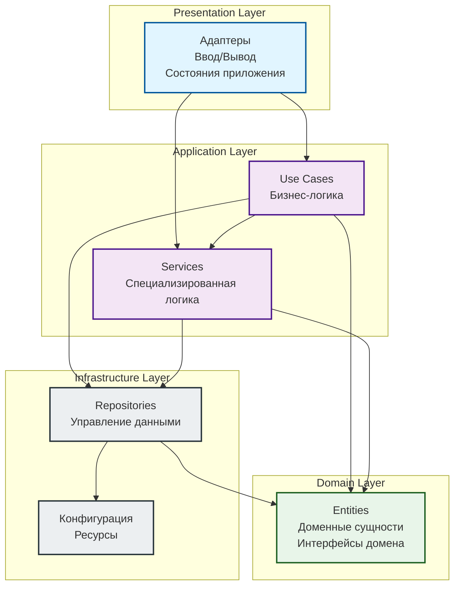

# 🎮 Gonflict

[](https://golang.org/)
[](LICENSE)
[](https://ebiten.org/)

Классическая аркадная игра-клон Battle City на Go с использованием Ebiten. Разработана с применением принципов Clean Architecture и Domain-Driven Design.

## 📖 Описание

Gonflict — это ремейк культовой игры Battle City (Tank 1990) для NES. Игрок управляет танком, сражается с врагами, разрушает блоки и защищает базу на сетке 26x26.

### Основные особенности

- ✅ Полнофункциональный игровой процесс с физикой движения
- ✅ Продвинутая система торможения с доезжанием до сетки
- ✅ AI врагов на Lua-скриптах
- ✅ Система коллизий и разрушаемых блоков
- ✅ Анимации спавна, движения и взрывов
- ✅ 35 уровней с различной конфигурацией
- ✅ Звуковое сопровождение
- ✅ Clean Architecture с четким разделением слоев
- ✅ Разделение Use Cases на специализированные компоненты
- ✅ Интерфейсы для всех Use Cases (Dependency Inversion Principle)

## 🎯 Текущий статус

### ✅ Реализовано

- [x] **Основной игровой цикл**
  - [x] Система состояний игры (Spawning, Moving, Stopped, Braking, Exploding)
  - [x] Обновление и отрисовка игровых объектов
  - [x] Обработка пользовательского ввода

- [x] **Танк игрока**
  - [x] Движение с пошаговой системой (до кратного 4)
  - [x] Продвинутое торможение с доезжанием до сетки
  - [x] Поворот во время движения (с доезжанием до кратного 4)
  - [x] Стрельба пулями
  - [x] Анимации движения (гусеницы)
  - [x] Анимации спавна и взрыва

- [x] **Система торможения**
  - [x] Автоматическое доезжание до координаты кратной 4
  - [x] Обработка смены направления во время торможения
  - [x] Возврат на 0.5 назад при переезде целевой точки
  - [x] Вынесено в отдельный сервис `TankBrakingService`

- [x] **Враги и AI**
  - [x] Система вражеских танков
  - [x] AI на Lua-скриптах (gopher-lua)
  - [x] Анимации спавна и движения врагов
  - [x] Система спавнеров

- [x] **Пули и коллизии**
  - [x] Создание и обновление пуль
  - [x] Коллизии пуль с блоками и танками
  - [x] Разрушение блоков
  - [x] Анимации взрыва

- [x] **Карта и блоки**
  - [x] Загрузка уровней (35 уровней)
  - [x] Типы блоков:
    - Кирпич (разрушаемый)
    - Сталь (неразрушаемый)
    - Лес (прозрачный)
    - Вода (непроходимая)
    - Лед (скользкий)
  - [x] Коллизии танка с блоками

- [x] **Графика и анимации**
  - [x] Система тайлсетов (YAML конфигурация)
  - [x] Статические тайлы
  - [x] Анимационные тайлы с offset
  - [x] Поворот изображений по направлению

- [x] **База и защита**
  - [x] База (HQ) на карте (фиксированная позиция)
  - [x] База разрушается от пуль врагов
  - [x] Визуализация базы (статический спрайт)
  - [x] Анимация взрыва базы

- [x] **Архитектура**
  - [x] Clean Architecture (Presentation, Application, Domain, Infrastructure)
  - [x] Разделение на Use Cases (10 специализированных компонентов)
  - [x] Репозитории для данных (Game, Processed, Raw)
  - [x] Сервисы (9 специализированных сервисов)
  - [x] Адаптеры (Input, Renderer, AI)
  - [x] Разделение AI на слои (LuaEngine, AITypeConverter, AIUseCases)
  - [x] Интерфейсы для всех компонентов (Dependency Inversion)

- [x] **Звуки**
  - [x] Загрузка звуковых файлов
  - [x] Воспроизведение звуков (стрельба, взрывы, фон)

### 🚧 В процессе

- [ ] Система очков и статистики
- [ ] Меню и экраны (главное меню, game over, победа)
- [ ] Бонусы и power-ups
- [ ] Система жизней игрока
- [ ] Game Over при уничтожении базы (требуется интеграция)

### 📋 TODO / Планируется

- [ ] **Игровая механика**
  - [ ] Разные типы врагов с различным поведением
  - [ ] Бонусы при уничтожении врагов
  - [ ] Система уровней сложности
  - [ ] Временные лимиты на уровни
  - [ ] Защита базы от врагов

- [ ] **UI/UX**
  - [ ] Главное меню
  - [ ] Экран выбора уровня
  - [ ] HUD с очками, жизнями, уровнем
  - [ ] Экран Game Over
  - [ ] Экран победы
  - [ ] Пауза (ESC)
  - [ ] Настройки (громкость, управление)

- [ ] **Геймплей**
  - [ ] Разные типы танков для игрока
  - [ ] Улучшения танка (броня, скорость, мощность снарядов)
  - [ ] Боссы на уровнях
  - [ ] Система прогресса и сохранений

- [ ] **Технические улучшения**
  - [ ] Оптимизация производительности
  - [ ] Расширение тестового покрытия
  - [ ] Документация API
  - [ ] CI/CD pipeline

- [ ] **Портирование**
  - [ ] Поддержка других платформ (Windows, Linux)
  - [ ] Мобильная версия (Android/iOS через gomobile)

## 🚀 Установка и запуск

### Требования

- Go 1.24 или выше
- [Just](https://github.com/casey/just) (опционально, для команд сборки)

### Установка

```bash
# Клонируйте репозиторий
git clone https://github.com/shpaker/gonflict.git
cd gonflict

# Установите зависимости
go mod download
```

### Запуск

```bash
# С Just (рекомендуется)
just run

# Или напрямую
go run cmd/main.go

# Сборка релизной версии
just build
./dist/gonflict
```

### Доступные команды (Just)

```bash
just build            # Собрать приложение
just run              # Собрать и запустить
just dev              # Запустить в режиме разработки
just test             # Запустить тесты
just test-coverage    # Тесты с покрытием
just fmt              # Форматировать код
just fmt-check        # Проверить форматирование
just lint             # Запустить линтер
just lint-fix         # Исправить проблемы линтера
just clean            # Очистить собранные файлы
just check            # Все проверки (fmt-check, lint, test)
```

## 🎮 Управление

| Клавиша | Действие |
|---------|----------|
| `W` | Движение вверх |
| `S` | Движение вниз |
| `A` | Движение влево |
| `D` | Движение вправо |
| `Space` | Стрельба |
| `Escape` | Выход (планируется: пауза) |

### Особенности управления

- **Пошаговое движение**: Танк автоматически доезжает до координаты кратной 4 при отпускании клавиши
- **Смена направления**: При нажатии новой клавиши направления во время движения, танк сначала доезжает до кратного 4, затем поворачивается
- **Торможение**: Плавное торможение с выравниванием по сетке

## 🏗️ Архитектура

Проект следует принципам **Clean Architecture** с четким разделением на слои:

```
internal/
├── adapters/          # Presentation Layer
│   ├── input_adapters/    # Адаптеры ввода
│   └── renderer_adapter.go # Адаптер отрисовки
├── states/            # Presentation Layer
│   └── game_state.go      # Управление состоянием игры
├── use_cases/         # Application Layer
│   ├── tank_common_use_cases.go
│   ├── tank_actions_use_cases.go
│   ├── tank_lifecycle_use_cases.go
│   ├── tank_render_use_cases.go
│   ├── bullet_use_cases.go
│   ├── collision_use_cases.go
│   ├── hq_use_cases.go
│   ├── ai_use_cases.go
│   ├── map_use_cases.go
│   └── tile_use_cases.go
├── services/          # Application Layer
│   ├── tank_braking_services.go
│   ├── coordinate_services.go
│   ├── boundary_collision_service.go
│   ├── wall_collision_service.go
│   ├── bullet_collision_service.go
│   ├── tile_services.go
│   ├── animation_services.go
│   ├── image_services.go
│   └── ai_type_converter.go
├── types/             # Domain Layer
│   ├── tank_entity.go
│   ├── bullet_entity.go
│   ├── block_entity.go
│   ├── hq_entity.go
│   ├── session_entity.go
│   ├── battle_entity.go
│   └── image_providers/  # Image provider implementations
│       ├── static_provider.go
│       └── animation_provider.go
└── repositories/      # Infrastructure Layer
    ├── game/              # In-memory репозитории
    ├── processed/         # Обработанные данные
    └── raw/               # Загрузка файлов
```

### Архитектурная диаграмма слоёв



### Описание слоёв

#### 1. Presentation Layer (Слой представления)
**Ответственность:** Взаимодействие с внешним миром (пользователь, графический движок)
- **cmd/main.go** — точка входа приложения
- **internal/app.go** — главное приложение, реализует интерфейс Ebiten Game
- **internal/adapters/RendererAdapter** — адаптер для рендеринга игровых объектов в Ebiten
- **internal/adapters/input_adapters/** — адаптеры ввода (клавиатура, AI)

#### 2. Application/State Layer (Слой приложения/состояний)
**Ответственность:** Управление состояниями приложения и оркестрация Use Cases
- **internal/states/GameState** — состояние игры, координирует обновление, отрисовку и координацию Use Cases

#### 3. Use Cases / Business Logic Layer (Слой бизнес-логики)
**Ответственность:** Реализация бизнес-правил и игровой логики
- **TankCommonUseCases** — логика движения танков
- **TankActionsUseCases** — логика действий (поворот, движение, стрельба)
- **TankRenderUseCases** — логика графики и анимаций танков
- **TankLifecycleUseCases** — логика жизненного цикла (спавн, взрыв)
- **BulletUseCases** — логика движения и взаимодействия пуль
- **MapUseCases** — логика работы с картой и блоками
- **CollisionUseCases** — логика определения и обработки коллизий
- **TilesUseCases** — логика работы с тайлами и анимациями
- **AIUseCases** — логика AI врагов
- **HQUseCases/HQRenderUseCases** — логика работы с базой (объединены в один файл)

#### 4. Services Layer (Слой сервисов)
**Ответственность:** Специализированная бизнес-логика, выделенная из Use Cases
- **TankBrakingService** — логика торможения танков
- **CoordinateService** — работа с координатами (округление до кратного 4)
- **BoundaryCollisionService** — коллизии с границами карты
- **WallCollisionService** — коллизии со стенами и блоками
- **BulletCollisionService** — коллизии пуль с объектами (стены, танки, база)
- **TileService** — работа с тайлами и создание анимаций из конфигурации
- **AnimationService** — обновление анимаций
- **ImageService** — работа с изображениями (поворот по направлению)
- **AITypeConverter** — конвертация типов Go ↔ Lua (Application Service)
- **LuaEngine** — работа с Lua VM (Infrastructure, в `adapters/input_adapters/ai/`)

#### 5. Domain / Entities Layer (Слой домена/сущностей)
**Ответственность:** Представление доменных сущностей и их поведения
- **TankEntity** — танк (игрок и враги)
- **BulletEntity** — пуля
- **BlockEntity** — блок карты
- **HQEntity** — база
- **SessionEntity** — игровая сессия
- **BattleEntity** — боевая сущность
- **GameAiContext** — контекст для AI
- **Image Providers** (`image_providers/`) — статические и анимационные провайдеры изображений
- Чистый домен без зависимостей от других слоёв

#### 6. Repository Layer (Слой репозиториев)
**Ответственность:** Управление данными и доступ к хранилищам
- **Game Repositories** — хранение игровых объектов в памяти (танки, пули, блоки, анимации)
- **Processed Repositories** — загрузка и обработка карт, тайлсетов, Lua-скриптов
- **Raw Repositories** — низкоуровневое чтение файлов из assets

#### 7. Infrastructure Layer (Слой инфраструктуры)
**Ответственность:** Конфигурация и ресурсы приложения
- **config.yml** — конфигурационный файл
- **assets/** — ресурсы игры (уровни, тайлсеты, звуки, скрипты)

### Принцип зависимостей

Все зависимости направлены **внутрь**:
- Внешние слои зависят от внутренних
- Внутренние слои не знают о внешних
- Domain Layer не зависит ни от чего (чистое ядро)

### Основные компоненты

**Use Cases (10 компонентов):**
- **TankCommonUseCases** — общая логика движения танков
- **TankActionsUseCases** — логика действий танков (поворот, движение, стрельба)
- **TankRenderUseCases** — логика графики танков
- **TankLifecycleUseCases** — логика жизненного цикла танков (спавн, взрыв)
- **BulletUseCases** — создание и обновление пуль
- **CollisionUseCases** — обработка коллизий
- **HQUseCases** — логика базы (обработка попаданий и взрывов)
- **AIUseCases** — логика AI врагов
- **MapUseCases** — логика работы с картой и блоками
- **TilesUseCases** — управление тайлами и анимациями

**Services:**
- **TankBrakingService** — логика торможения
- **CoordinateService** — работа с координатами
- **BoundaryCollisionService** — коллизии с границами
- **WallCollisionService** — коллизии со стенами
- **BulletCollisionService** — коллизии пуль
- **TileService** — работа с тайлами
- **AnimationService** — обновление анимаций
- **ImageService** — работа с изображениями
- **AITypeConverter** — конвертация типов Go ↔ Lua

**Repositories:**
- **GameRepositoriesRegistry** — реестр игровых репозиториев
- **ITilesetRepositoryRegistry** — реестр тайлсетов
- **IMapsDataRepository** — карты уровней
- **IFileRepository** — чтение файлов

## 🛠️ Технологии

- **[Go 1.24+](https://golang.org/)** — основной язык
- **[Ebiten v2](https://ebiten.org/)** — игровой движок
- **[gopher-lua](https://github.com/yuin/gopher-lua)** — интеграция Lua для AI
- **[YAML](https://yaml.org/)** — конфигурация тайлсетов и уровней

## 📦 Структура проекта

```
gonflict/
├── assets/           # Игровые ресурсы
│   ├── levels/       # 35 уровней
│   ├── scripts/     # Lua скрипты для AI
│   ├── sounds/      # Звуковые файлы
│   └── tiles/       # Тайлсеты и конфигурация
├── cmd/             # Точка входа
├── dist/            # Собранные файлы
├── docs/            # Документация
├── internal/        # Внутренний код приложения
│   ├── adapters/    # Адаптеры
│   ├── repositories/# Репозитории
│   ├── services/    # Сервисы
│   ├── states/      # Состояния игры
│   ├── types/       # Доменные типы
│   └── use_cases/   # Use Cases
├── config.yml       # Конфигурация игры
└── justfile         # Команды сборки
```

## 🧪 Тестирование

```bash
# Запустить все тесты
go test ./...

# Тесты с покрытием
go test -cover ./...

# Подробный отчет
go test -v -coverprofile=coverage.out ./...
go tool cover -html=coverage.out
```

## 🤝 Вклад

Вклады приветствуются! Если вы хотите внести свой вклад:

1. Fork проекта
2. Создайте ветку для новой функции (`git checkout -b feature/amazing-feature`)
3. Commit изменения (`git commit -m 'Add amazing feature'`)
4. Push в ветку (`git push origin feature/amazing-feature`)
5. Откройте Pull Request

Перед отправкой PR убедитесь:
- Код следует стилю проекта
- Добавлены тесты для новой функциональности
- Документация обновлена

## 📄 Лицензия

Этот проект лицензирован под MIT License — см. файл [LICENSE](LICENSE) для деталей.

## 🙏 Благодарности

- Вдохновлено классической игрой Battle City / Tank 1990 для NES
- Спрайты и ресурсы основаны на оригинальных NES материалах
- Спасибо сообществу Go и разработчикам Ebiten

## 📞 Контакты

- Issues: [GitHub Issues](https://github.com/shpaker/gonflict/issues)
- Discussions: [GitHub Discussions](https://github.com/shpaker/gonflict/discussions)

---

**Приятной игры! 🎮**

