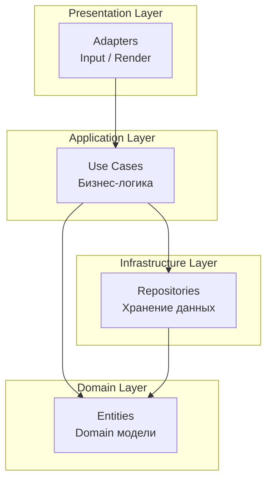
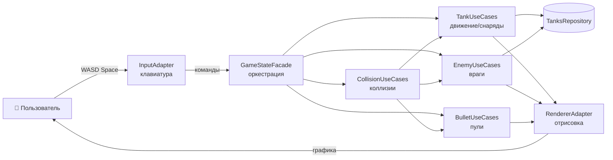
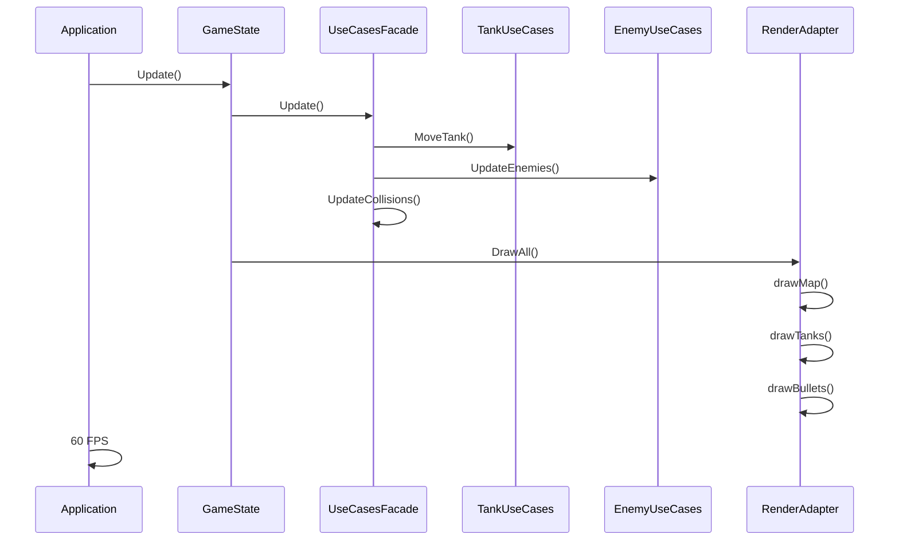

# Gonflict

Игра-клон Battle City (Танчики) на Go с использованием Ebiten. Проект построен на принципах Clean Architecture для изучения игровой разработки.

## 🎮 Особенности

- ✅ **Clean Architecture** - четкое разделение слоев (Use Cases, Adapters, Repositories)
- ✅ **Dependency Injection** - инверсия зависимостей через интерфейсы
- ✅ **Тестируемость** - легко тестировать бизнес-логику
- ✅ **Расширяемость** - простое добавление новых функций
- ✅ **Конфигурация** - настройка через `config.yml`
- ✅ **Модульная архитектура** - отдельные адаптеры для разных типов ресурсов
- ✅ **Поворот изображений** - динамический поворот спрайтов по направлению
- ✅ **Враги на карте** - танки врагов с анимацией спавна и уничтожением
- ✅ **Единый репозиторий танков** - TanksRepository для игрока и врагов

## 📁 Структура проекта

```
gonflict/
├── cmd/
├── internal/
│   ├── adapters/
│   ├── repositories/
│   │   ├── game/
│   │   ├── processed/
│   │   └── raw/
│   ├── states/
│   ├── types/
│   ├── use_cases/
│   └── utils/
├── assets/
│   ├── levels/
│   ├── sounds/
│   └── tiles/
├── go.mod
├── go.sum
├── justfile
└── README.md
```

## 🏗️ Архитектура

Проект следует принципам **Clean Architecture**:

### Диаграмма слоев архитектуры



### Диаграмма взаимодействия компонентов



### Диаграмма игрового цикла



### Принципы архитектуры

1. **Dependency Rule (Правило зависимостей)** - зависимости направлены внутрь к ядру:
   - Presentation Layer зависит от Application Layer
   - Application Layer зависит от Domain Layer
   - Infrastructure Layer зависит от Domain Layer

2. **Interface Segregation** - интерфейсы определяются там, где используются:
   - Use Cases определяют свои интерфейсы в `interfaces.go`
   - Repositories предоставляют абстракции для данных

3. **Dependency Inversion** - зависимость от абстракций, а не реализаций:
   - GameState зависит от интерфейсов Use Cases
   - Use Cases зависят от интерфейсов Repositories
   - Конкретные реализации незначимы для бизнес-логики

4. **Single Responsibility** - каждый компонент отвечает за одну задачу:
   - `TankUseCases` - только логика танков
   - `BulletUseCases` - только логика пуль
   - `InputAdapter` - только обработка ввода
   - `RendererAdapter` - только отрисовка

### Поток данных

```
[Пользователь] 
    ↓
[InputAdapter] → [TankUseCases / BulletUseCases]
    ↓
[GameStateUseCasesFacade] → [Update/Logic]
    ↓
[Repositories] ← [Domain Entities]
    ↓
[RenderAdapter] → [Экран]
```

### Структура слоев

- **Presentation Layer** (синий) - взаимодействие с пользователем и внешним миром
- **Application Layer** (фиолетовый) - бизнес-логика и правила игры
- **Domain Layer** (зеленый) - сущности и типы игры
- **Infrastructure Layer** (оранжевый) - хранение и загрузка данных
- **Supporting Components** (розовый) - вспомогательные компоненты

## 🚀 Быстрый старт

### Требования

- Go 1.24.3 или выше
- Ebiten 2.x (игровой движок)
- Just (опционально) - [установка](https://github.com/casey/just#installation)

### Установка и запуск

1. Клонируйте репозиторий:
```bash
git clone <repository-url>
cd gonflict
```

2. Установите зависимости:
```bash
go mod download
```

3. Запустите приложение:
```bash
# С Just
just run

# Без Just
go run cmd/main.go
```

### Конфигурация через config.yml

Создайте файл `config.yml` в корне проекта:

```yaml
app:
  name: "gonflict"

game:
  spawn_duration_ms: 1000
  enemy_spawners:
    - [0, 0]   # Левый верхний угол
    - [7, 0]   # Центр сверху
    - [13, 0]  # Правый верхний угол
```

Приложение автоматически загрузит конфигурацию при запуске.

## 🔄 Ключевые изменения

### Архитектурные улучшения

- **Система анимаций** - централизованное управление через AnimationUseCases
- **Спавнер танка** - анимированный объект для появления танка игрока
- **Новый формат анимаций** - компактный YAML формат с duration и frames
- **Clean Architecture** - четкое разделение слоев (Use Cases, Adapters, Repositories)
- **Dependency Injection** - инверсия зависимостей через интерфейсы
- **Тестируемость** - легко тестировать бизнес-логику
- **TanksRepository** - единый репозиторий для танка игрока и врагов
- **Враги** - танки врагов с анимацией спавна и уничтожением
- **Конфигурация** - настройка через `config.yml` с врагами

### Технические детали

- **AnimationUseCases** - централизованное управление анимациями
- **SpawnerEntity** - сущность спавнера с анимацией
- **TankUseCases** - переименованный PlayerUseCases для лучшей семантики
- **Новый формат YAML** - duration и frames вместо массива объектов
- **Обратная совместимость** - существующий код анимации продолжает работать

## 🎮 Игровая функциональность

### Управление

- **W** - движение вверх
- **S** - движение вниз  
- **A** - движение влево
- **D** - движение вправо
- **Space** - стрельба
- **Escape** - выход

### Игровые объекты

- **Танк игрока** - управляемый танк с поворотом и стрельбой
- **Спавнер** - анимированный объект для появления танка
- **Блоки**:
  - `#` - Кирпич (разрушаемый)
  - `@` - Сталь (неразрушаемый)
  - `%` - Лес (прозрачный для танков)
  - `~` - Вода (непроходимая)
  - `-` - Лед (скользкий)
- **Пули** - снаряды с коллизиями
- **Уровни** - загружаемые карты 26x26

## 🛠️ Доступные команды (Just)

```bash
just build            # Собрать приложение
just run              # Собрать и запустить
just dev              # Запустить в режиме разработки
just test             # Запустить тесты
just test-coverage    # Тесты с покрытием
just clean            # Очистить собранные файлы
just fmt              # Форматировать код
just lint             # Запустить линтер
just check            # Все проверки (fmt, lint, test)
just ci               # Полный CI pipeline
just help             # Показать все команды
```

## 📚 Компоненты системы

### Presentation Layer (Слой представления)

- **App** - главное приложение Ebiten, точка входа
- **GameState** - игровое состояние, управляет игровым процессом
- **InputAdapter** - адаптер ввода с клавиатуры (WASD, Space)
- **RendererAdapter** - адаптер отрисовки игры через Ebiten

### Application Layer (Слой приложения)

- **GameStateUseCasesFacade** - фасад для оркестрации всех Use Cases
- **TankUseCases** - бизнес-логика танков игрока (движение, поворот, спавн)
- **EnemyUseCases** - бизнес-логика врагов (спавн, анимация, уничтожение)
- **BulletUseCases** - бизнес-логика пуль (создание, обновление, удаление)
- **MapUseCases** - бизнес-логика карты (работа с блоками)
- **CollisionUseCases** - бизнес-логика коллизий между объектами
- **AnimationUseCases** - бизнес-логика анимаций
- **TilesUseCases** - бизнес-логика тайлов (статические и анимированные)

### Domain Layer (Доменный слой)

**Типы данных:**
- **Direction** - направление движения (UP, DOWN, LEFT, RIGHT)
- **Position** - позиция в мире (X, Y)
- **Size** - размер объекта (Width, Height)
- **Altitude** - высота слоя отрисовки

**Сущности:**
- **TankEntity** - сущность танка игрока
- **BulletEntity** - сущность пули
- **BlockEntity** - сущность блока карты
- **SpawnerEntity** - сущность спавнера танка
- **TileStaticEntity** - статический тайл для отрисовки
- **TileAnimationEntity** - анимированный тайл

### Infrastructure Layer (Слой инфраструктуры)

**Game Repositories (In-memory):**
- **TanksRepository** - единое хранилище танков (игрока и врагов)
- **BlocksRepository** - хранилище блоков карты
- **BulletsRepository** - хранилище пуль
- **AnimationsRepository** - хранилище активных анимаций

**Processed Repositories:**
- **MapsDataRepository** - загрузка и обработка уровней
- **TilesetRepository** - загрузка и кеширование тайлсетов

**Raw Repositories:**
- **FileRepository** - чтение файлов из assets

### Supporting Components (Вспомогательные компоненты)

- **Config** - конфигурация приложения
- **Utils** - вспомогательные функции

## 🧪 Тестирование

```bash
# Запустить все тесты
go test ./...

# Тесты с покрытием
go test -cover ./...

# Подробный отчет
go test -v -coverprofile=coverage.out ./...
go tool cover -html=coverage.out
```

### Примеры тестов

- `repositories/game/*_test.go` - тесты репозиториев
- `repositories/processed/*_test.go` - тесты обработки данных
- `repositories/raw/*_test.go` - тесты чтения файлов
- `utils/utils_test.go` - тесты утилит

## 🔧 Расширение проекта

### Добавление новой функциональности

1. **Создайте Use Case** в `use_cases/`
2. **Определите интерфейс** в `use_cases/interfaces.go`
3. **Реализуйте логику** в отдельном файле
4. **Добавьте тесты** `*_test.go`
5. **Используйте в GameState**

### Пример: использование TanksRepository

```go
// TanksRepository - единое хранилище для всех танков
type TanksRepository struct {
    tanks []*types.TankEntity
}

// Индекс 0 - танк игрока
// Индексы 1, 2, 3... - враги
func (tr *TanksRepository) GetTank(index int) (*types.TankEntity, error) {
    if index < 0 || index >= len(tr.tanks) {
        return nil, fmt.Errorf("индекс танка %d вне диапазона", index)
    }
    return tr.tanks[index], nil
}
```

### Идеи для расширения

- 🤖 **ИИ врагов** - добавить поведение вражеских танков
- 🎯 **Система очков** - подсчет очков за уничтожение
- 🎨 **Меню и UI** - главное меню, экран победы/поражения
- 🌐 **Сетевой режим** - мультиплеер
- 🏆 **Достижения** - система наград
- 🛠️ **Редактор уровней** - создание своих карт
- 💥 **Эффекты** - взрывы, частицы
- 🎵 **Музыка** - фоновая музыка
- 🎮 **Дополнительные уровни** - больше карт

## 📝 Соглашения по коду

### Именование файлов

```
✅ Хорошо:
player_use_cases.go
collision_service.go
interfaces.go
constants.go

❌ Плохо:
_player.go         # Не начинайте с _
PlayerUseCases.go  # Не используйте PascalCase
```

### Структура файлов в пакете

```
package_name/
├── interfaces.go     # Все интерфейсы (будет первым при сортировке)
├── constants.go      # Все константы
├── entity1.go        # Реализации
├── entity2.go
└── service.go
```

### Импорты

```go
// Всегда используйте централизованный repositories пакет
import "github.com/shpaker/gonflict/internal/repositories"

// raw импортируется отдельно только где необходимо
import "github.com/shpaker/gonflict/internal/repositories/raw"
```

## 🐛 Известные ограничения

- Только один игрок
- Враги пока статичны (нет ИИ)
- Нет главного меню
- Нет сохранений
- Нет звуковых эффектов
- Нет системы очков
- Спавнер не имеет коллизий

## 🤝 Вклад в проект

1. Fork проекта
2. Создайте feature branch (`git checkout -b feature/amazing-feature`)
3. Commit изменений (`git commit -m 'Add amazing feature'`)
4. Push в branch (`git push origin feature/amazing-feature`)
5. Откройте Pull Request

## 📄 Лицензия

MIT License

## 📝 История изменений

### Последние обновления

- ✅ **Рефакторинг PlayerUseCases в TankUseCases** - переименование для лучшей семантики
- ✅ **Система анимаций** - централизованное управление анимациями через AnimationUseCases
- ✅ **Спавнер танка** - анимированный объект для появления танка игрока и врагов
- ✅ **Новый формат анимаций** - компактный YAML формат с duration и frames
- ✅ **Clean Architecture** - четкое разделение слоев и зависимостей
- ✅ **Dependency Injection** - инверсия зависимостей через интерфейсы
- ✅ **TanksRepository** - единый репозиторий для танка игрока и врагов
- ✅ **Враги** - танки врагов с анимацией спавна и уничтожением пулями игрока
- ✅ **Конфигурация** - настройка через `config.yml` с позициями спавна врагов

### Планируемые улучшения

- 🤖 **ИИ врагов** - добавить поведение вражеских танков
- 🎯 **Система очков** - подсчет очков за уничтожение
- 🎨 **Меню и UI** - главное меню, экран победы/поражения
- 🌐 **Сетевой режим** - мультиплеер
- 🏆 **Достижения** - система наград
- 🛠️ **Редактор уровней** - создание своих карт
- 💥 **Эффекты** - взрывы, частицы
- 🎵 **Музыка** - фоновая музыка
- 🎮 **Дополнительные уровни** - больше карт

## 📚 Полезные ссылки

- [Ebiten Documentation](https://ebiten.org/)
- [Clean Architecture](https://blog.cleancoder.com/uncle-bob/2012/08/13/the-clean-architecture.html)
- [Go Project Layout](https://github.com/golang-standards/project-layout)
- [Just Command Runner](https://github.com/casey/just)
