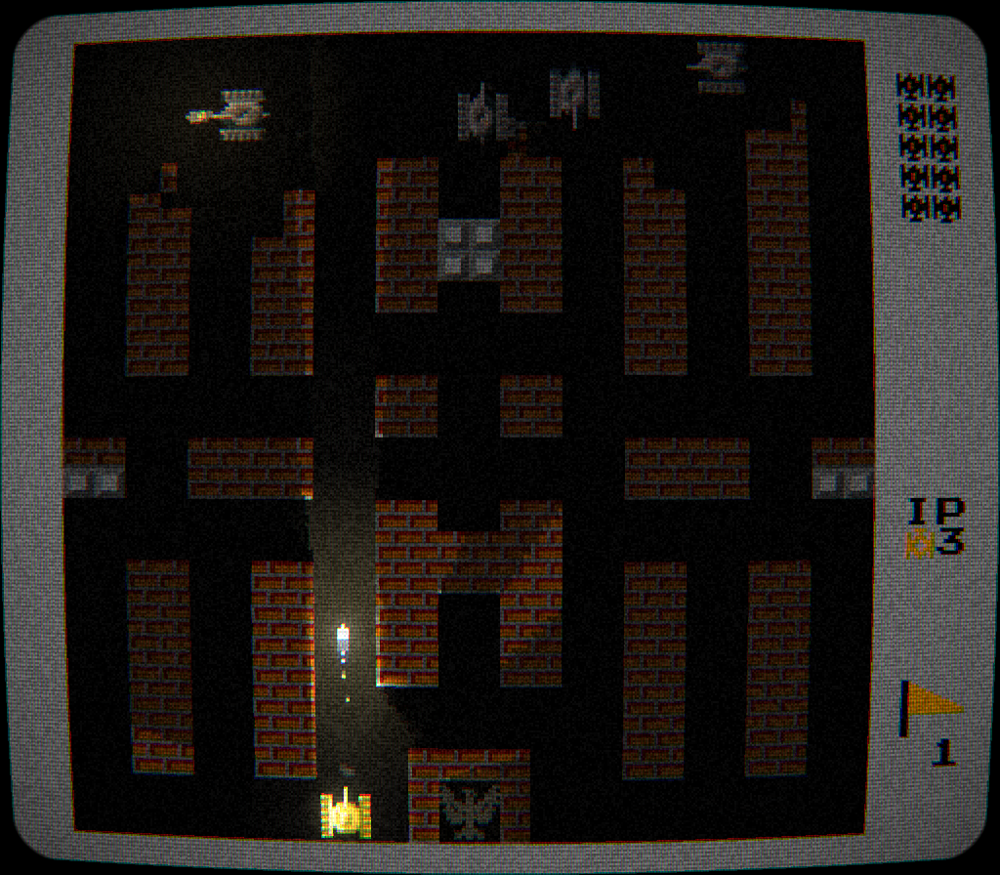
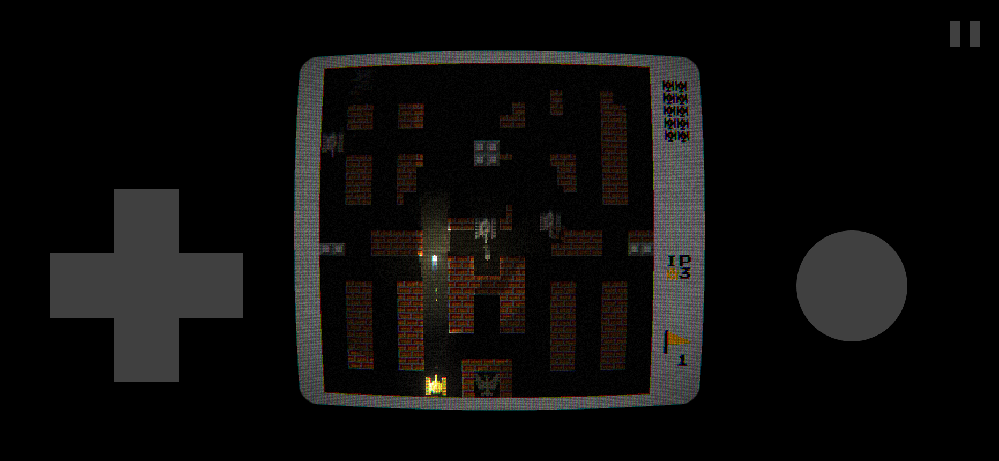

# tnk9x

A modern remake and tribute to the classic arcade game Battle City (NES, 1985), built with Go and Ebiten. This project combines a passion for the original game with learning Go, Clean Architecture principles, and game development.

**Play online:** [https://shpaker.github.io/tnk9x/](https://shpaker.github.io/tnk9x/)

[](https://shpaker.github.io/tnk9x/)

*Stage 1 with normal graphics: headlights, bullet tracers, lit bricks and steel, tube TV filter.*

[](https://shpaker.github.io/tnk9x/)

*WebAssembly build in a mobile browser — touch controls are auto-detected.*

## Development Status

**Playable now:**

- Splash screen (SHPAKER logo from `assets/images/shpaker.png`, a text placeholder until it is drawn) with a real resource loading bar, fading through black into the main menu: 1 player, 2 players, settings, quit (desktop only)
  - Behind the menu a live title scene (`assets/levels/demo/title.bcmap`): a one-line TNK9X (TNK in brick, 9X in steel) assembles block by block, then one enemy tank of each type roams the field under the real Lua AI and shoots; chipped title bricks slowly grow back one at a time; bullet hits on brick and steel are heard, the scene is not dimmed, the menu items are drawn with a black outline
- Full game loop with HQ and a results screen that appears in stages: backdrop, result, stars one by one with a sound, time and lives lost, then the menu (any button skips the animation); next stage, retry or back to stage select
- One or two players, chosen in the main menu, each mode with its own campaign progress; each player has a keyboard layout, a gamepad and touch controls at once
  - Default keys: P1 WASD and G to fire, P2 IJKL and ' to fire; rebind in settings
- Gamepad support (standard layout, desktop and browser): the first connected gamepad drives P1, the second P2; D-pad or left stick to move, A to fire (rebindable), Start to pause; any gamepad drives the menus (A to select, B to go back)
- Touch controls for mobile browsers: auto-detected virtual D-pad, fire and pause in the letterbox area on every screen; in two-player mode each player gets a D-pad and fire on their own side of the device (left and right in landscape, bottom and top in portrait); menus are driven by the same controls (D-pad to move, fire to select, pause to go back)
- Tank movement with braking and grid snap
- Bullets and destructible terrain with incremental brick chipping: each hit shaves a half-tile slab, reinforced bullets break tiles whole
- All five surface types (brick, steel, forest, water, ice) with ice sliding and water blocking (a tank with a boat sails over it)
- Lua-scripted enemies of four types; each map file sets its enemy waves (tank order, pause, start condition: now, left<=N, clear), bonus carriers and on-field limit, see [assets/levels/README.md](assets/levels/README.md)
  - The armored tank flashes between its normal and a tinted sprite as in the NES original; the tint shows the armor left (red, yellow, green)
  - Bonus carriers flash red as in the NES original; an armored carrier flashes red too
- Weighted enemy spawn point choice: blocked points are skipped, the last used point and points near a player are picked less often
- Enemy AI with per-type personalities and difficulty scaling by stage:
  - NES-style targeting: roam, then hunt the player, then head for the HQ
  - Aimed fire with reaction delay: turns to a player on the line of fire, breaches walls towards the HQ, never wastes shots on allies or steel
  - Pathfinding around steel and water (across water with a boat), shooting through bricks, recovery when stuck
  - Active demolition: fire at walls ahead on the move and carve passages through side walls
  - Bullet dodging and counter-fire for fast tanks on later stages
- Player lives, levels and damage
- Reload pause between shots on top of the bullets-in-flight limit: 0.33-0.2 s for the player by level, 0.3-0.5 s for enemies by type, so point-blank fire is not every frame (`game.shot_cooldown`)
- All eight bonuses: grenade, tank, star, helmet shield, enemy-freezing timer, HQ-fortifying shovel, and two from Tank 1990:
  - Boat: the tank sails over water and the boat takes one hit instead of the tank; a tank that loses its boat on water can still reach the shore
  - Pistol: the tank gets the top level at once, so it survives three hits
- Enemies pick up bonuses too, as in Tank 1990 (`game.enemy_bonus_pickup`, on by default): the enemy nearest to a dropped bonus races for it; helmet and boat go to the enemy itself, star and pistol make it stronger, grenade blows up the players, timer freezes them, shovel strips the HQ walls, tank adds an enemy to the reserve
- Campaign of 35 stages in 7 packs (`assets/levels/main.bccamp`): stage select screen with a minimap preview, enemy composition and 3-star time; stages open one after another, packs open for collected stars
- Stars per stage: win, no lives lost, within the time limit; best results are saved per mode (OS config folder on desktop, the web platform's storage in the browser: localStorage, cloud saves on Yandex Games)
- Continue after a win: carry lives (at least 3) and tank level to the next stage, capped at 2 stars; offered only when it gives an edge, with a caption under the menu item explaining the difference from the next stage
- Pause menu on Esc, gamepad Start or the touch pause button (continue, restart, settings, exit to stage select)
- Esc, B, Start or the touch pause button on the stage select goes back to the main menu; with touch controls or a mouse the stage select also shows a tappable MAIN MENU button
- Mouse in menus (main menu, settings, controls, stage select, pause, stage results): hover highlights an item, left click selects it, right click goes back, the wheel changes values; taps on menu items work the same way; the cursor is hidden during battle
- Settings menu, shared by the main menu and the pause menu (keyboard, gamepad and touch):
  - Graphics (normal or classic), fullscreen (desktop only) and volume (0-100% in 10% steps), applied at once
  - Controls: keyboard keys and gamepad buttons of both players and the graphics and fullscreen hotkeys; press a key to assign it, a key already used elsewhere is refused; reset all to defaults
  - Saved between launches next to the progress (OS config folder on desktop, the web platform's storage in the browser); `config.yml` holds only the game's own settings
- Desktop starts fullscreen by default; toggle with F11 or in settings (the hotkey also works in the browser)
- Sound effects and music
- NES-style sidebar HUD (enemy reserve, player lives, stage flag) on an authentic 256x224 screen
- Normal graphics with effects, on by default: 2D ray-traced lighting and shadows from tanks, bullets, explosions and bonuses, bloom, water/ice/steel glints, tube TV filter; switch to classic graphics without effects with F2 or in settings
  - No fog of war: the whole field is visible, lights only brighten it
  - Headlights on every tank: a cone along the barrel that turns smoothly with the tank; the player's is long and bright with a soft aura around the tank, enemies' is shorter and reddish; walls are buildings, so light falls on their facades and they cast shadows
  - Bullets glow like tracers and light up the corridor they fly through
  - Materials: steel facades have a metallic sheen that blooms under bright light, brick is matte
  - The stage starts with the player tank already on the map; respawns after death keep the spawn animation
  - Flashing objects glow in step with their flashing: a dropped bonus softly flares up and fades within each lit phase; a bonus carrier and an armored tank pulse with a wide outer glow like the force field, in their muted tint color, rising and fading with each color change
  - Invulnerability after spawning, as in the original: an animated force field over the tank in both graphics modes, pulsing with a flickering glow in normal graphics (also for the helmet bonus)
  - Tube TV look on every screen, menus included: a curved screen with rounded corners and faintly glowing glass that stays visible on dark menus, aperture grille, scanlines that widen on bright pixels, phosphor afterglow, R/B convergence drift towards the edges, light film grain, flicker, a rolling bar, and line tearing on strong hits
  - Bullet tracers: sparks trail behind a flying bullet, denser for fast bullets, blue-white for steel-piercing ones, which also glow blue-white
  - Muzzle flashes: a short light cone along the barrel with a smoke puff
  - Muzzle flashes with recoil, wall debris in the colors of the destroyed cells, steel and shield sparks, sparks and a flash when bullets collide, explosion embers and smoke, track dust, screen shake on hits and explosions (stronger for the player)
- Runs natively and [in the browser](https://shpaker.github.io/tnk9x/) (WebAssembly, deployed to GitHub Pages on release tags)
- Web platforms behind one neutral browser bridge, the same WebAssembly build everywhere; desktop builds are not affected:
  - The game pauses while the platform suspends it (hidden tab, an ad, the portal's own pause): the frame loop stops, sound goes silent, and a running stage returns to its pause menu
  - Yandex Games: SDK loading and gameplay markers, interstitial ads at natural breaks (leaving the results screen, restart or exit from the pause menu), cloud saves with migration of local saves, no external links; packaged by `just package-yandex` and uploaded to the developer console by hand
  - Rewarded ads, only where the platform offers them, never as the default menu item:
    - REVIVE on defeat by lost lives while the HQ is intact: one more tank for each player, the stage goes on (once per attempt, at most 1 star)
    - NEXT + BOOST and RETRY + BOOST: the next or the same stage starts with one more life and a tank level up, capped at 2 stars like Continue

**Under the hood:**

- Clean Architecture with depguard-enforced layer boundaries
- Constructor-only DI from a composition root, repository pattern
- Scripting behind a domain-typed engine interface: the Lua script owns all enemy behavior, Go passes a world snapshot and executes decisions
- Navigation service (Dijkstra pathfinding, line-of-fire ray casting) exposed to scripts as query functions
- Resources load step by step on the splash screen (sprites, campaign, progress, scripts, sounds), fail-fast on any broken asset; app-lifetime GPU sprite cache with preload and sprite/animation validation
- Kage shader pipeline: lighting pass with omni and cone lights on the logical screen, bloom, phosphor afterglow and CRT in the final-screen pass; shaders loaded via repository and compiled fail-fast on startup
- Visual effects driven by a per-frame event queue from gameplay use cases; particles, flashes and shake live in a per-stage repository
- Section-based text formats for maps and campaigns, parsed and validated fail-fast on startup
- User storage for progress, settings and controls behind repository interfaces (files on desktop, the platform bridge storage in WASM)
- Platform abstraction: `IPlatformAdapter` (suspension, readiness, gameplay markers, ad breaks) and `IRewardAdapter`, one adapter per build target by build tags (no platform on desktop, `window.tnk9xPlatform` in the browser); portal specifics live only in `web/<platform>/` (see [web/README.md](web/README.md)); `syscall/js` is confined to the platform adapter and the storage by depguard
- Input behind adapter interfaces: menu input (fixed keys, any gamepad, touch of either player, mouse), player input (rebindable keyboard, gamepad, touch) and hotkeys; states never poll input devices directly
- Unit tests with a >=70% use-cases coverage gate
- CI/CD (fmt, lint, test, build, release); desktop and js/wasm targets are both built and linted

### Roadmap
- HQ: defeat screen, protection mechanics
- UI: score
- Localization (required by Yandex Games for non-English catalogs)
- Test coverage >80% total, performance profiling

## Installation and Running

**Requirements:** Go 1.25+, optionally — [Just](https://github.com/casey/just).

```bash
git clone https://github.com/shpaker/tnk9x.git
cd tnk9x
just deps         # Install dependencies (or go mod download)

# Run the game
just run          # or go run cmd/main.go

# Build binary
just build        # binary will be in ./tnk9x

# Web builds (WebAssembly)
just serve-web            # GitHub Pages build at http://localhost:8000
just package-yandex       # Yandex Games archive in _build/, upload it to the console
just serve-yandex         # Yandex build via sdk-dev-proxy (Node.js; YANDEX_APP_ID from .env, dev mode without it)

# Checks
just fmt
just lint
just test
```

## Architecture

The project follows **Clean Architecture** principles with clear separation of concerns. Dependencies point inward: outer layers depend on inner layers through interfaces. The composition root (`internal/app`) is the only place that assembles the object graph — all dependencies are injected via constructors, layer boundaries are enforced by depguard.

### Dependency Flow

```
┌─────────────────────────────────────────────────────────┐
│  Composition Root (internal/app)                        │
│  game loop · state transitions · object graph assembly  │
└───────────────────┬─────────────────────────────────────┘
                    │ (builds & wires)
┌───────────────────▼─────────────────────────────────────┐
│  Presentation Layer                                     │
│  ┌──────────────┐  ┌──────────────────────┐             │
│  │   States     │  │      Adapters        │             │
│  │              │  │                      │             │
│  │ StageState   │  │ Renderer             │             │
│  │ StageSelect  │  │ Input                │             │
│  │              │  │ Sound                │             │
│  │              │  │ Scripting (Lua)      │             │
│  │              │  │ Platform (web/none)  │             │
│  └──────┬───────┘  └───────┬──────────────┘             │
│         └─────────┬────────┘                            │
│                   │ (depends on)                        │
└───────────────────▼─────────────────────────────────────┘
                    │
┌───────────────────▼─────────────────────────────────────┐
│  Application Layer                                      │
│  ┌──────────────┐  ┌──────────────┐                     │
│  │  Use Cases   │  │   Services   │                     │
│  │              │  │              │                     │
│  │ TankActions  │  │ Collision    │                     │
│  │ Collision    │  │ Animation    │                     │
│  │ Sound        │  │ Braking      │                     │
│  └──────┬───────┘  └──────┬───────┘                     │
│         └─────────┬───────┘                             │
│                   │ (manipulates)                       │
└───────────────────▼─────────────────────────────────────┘
                    │
┌───────────────────▼─────────────────────────────────────┐
│  Domain Layer                                           │
│  ┌───────────────────────────────────────────────────┐  │
│  │  Entities (Tank, Bullet, Block, HQ, etc.)         │  │
│  │  Value Objects (Position, Size, Direction)        │  │
│  │  Session Entities (GameSession, StageSession)     │  │
│  └───────────────────────────────────────────────────┘  │
│                   ▲                                     │
└───────────────────┼─────────────────────────────────────┘
                    │ (reads/writes)
┌───────────────────▼─────────────────────────────────────┐
│  Infrastructure Layer                                   │
│  ┌──────────────┐  ┌──────────────┐                     │
│  │ Repositories │  │   Raw Files  │                     │
│  │              │  │              │                     │
│  │ Game         │  │ FileSystem   │                     │
│  │ Processed    │  │              │                     │
│  └──────────────┘  └──────────────┘                     │
└─────────────────────────────────────────────────────────┘
```

## License

This project is licensed under the MIT License - see the [LICENSE](LICENSE) file for details.
