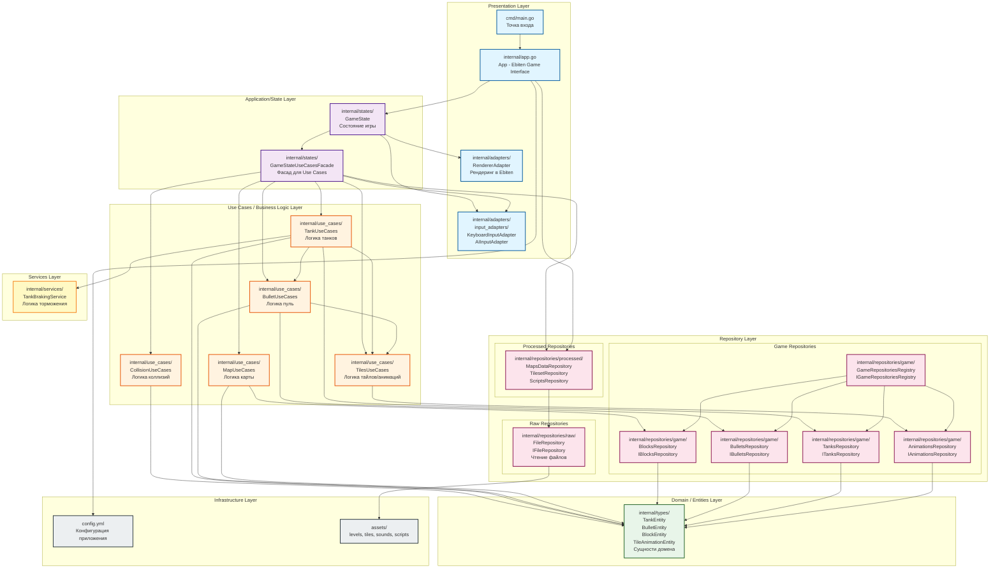

# Архитектурная диаграмма слоёв

## Структура слоёв приложения gonflict



## Описание слоёв

### 1. Presentation Layer (Слой представления)
**Ответственность:** Взаимодействие с внешним миром (пользователь, графический движок)

- **cmd/main.go** - Точка входа приложения, инициализация и запуск
- **internal/app.go** - Главное приложение, реализует интерфейс Ebiten Game
- **internal/adapters/RendererAdapter** - Адаптер для рендеринга игровых объектов в Ebiten
- **internal/adapters/input_adapters/** - Адаптеры ввода (клавиатура, AI)

**Зависимости:** Зависит только от Application Layer

---

### 2. Application/State Layer (Слой приложения/состояний)
**Ответственность:** Управление состояниями приложения и оркестрация Use Cases

- **internal/states/GameState** - Состояние игры, координирует обновление и отрисовку
- **internal/states/GameStateUseCasesFacade** - Фасад для координации Use Cases

**Зависимости:** Зависит от Use Cases Layer и Presentation Layer (адаптеры)

---

### 3. Use Cases / Business Logic Layer (Слой бизнес-логики)
**Ответственность:** Реализация бизнес-правил и игровой логики

- **internal/use_cases/TankUseCases** - Логика движения, поворотов, стрельбы танков
- **internal/use_cases/BulletUseCases** - Логика движения и взаимодействия пуль
- **internal/use_cases/MapUseCases** - Логика работы с картой и блоками
- **internal/use_cases/CollisionUseCases** - Логика определения и обработки коллизий
- **internal/use_cases/TilesUseCases** - Логика работы с тайлами и анимациями

**Зависимости:** Зависит от Domain Layer и Repository Layer

---

### 4. Services Layer (Слой сервисов)
**Ответственность:** Специализированная бизнес-логика, выделенная из Use Cases

- **internal/services/TankBrakingService** - Специализированная логика торможения танков

**Зависимости:** Зависит от Domain Layer

---

### 5. Domain / Entities Layer (Слой домена/сущностей)
**Ответственность:** Представление доменных сущностей и их поведения

- **internal/types/TankEntity** - Сущность танка
- **internal/types/BulletEntity** - Сущность пули
- **internal/types/BlockEntity** - Сущность блока карты
- **internal/types/TileAnimationEntity** - Сущность анимации тайла
- **internal/types/types.go** - Общие типы (Position, Direction, Size, Altitude и т.д.)

**Зависимости:** Не зависит от других слоёв (чистый домен)

---

### 6. Repository Layer (Слой репозиториев)
**Ответственность:** Управление данными и доступ к хранилищам

#### 6.1. Game Repositories (Игровые репозитории)
- **internal/repositories/game/GameRepositoriesRegistry** - Реестр игровых репозиториев
- **internal/repositories/game/BlocksRepository** - Хранение блоков карты в памяти
- **internal/repositories/game/BulletsRepository** - Хранение пуль в памяти
- **internal/repositories/game/TanksRepository** - Хранение танков в памяти
- **internal/repositories/game/AnimationsRepository** - Хранение анимаций в памяти

#### 6.2. Processed Repositories (Обработанные данные)
- **internal/repositories/processed/MapsDataRepository** - Загрузка и обработка карт уровней
- **internal/repositories/processed/TilesetRepository** - Загрузка и обработка тайлсетов
- **internal/repositories/processed/ScriptsRepository** - Загрузка Lua скриптов

#### 6.3. Raw Repositories (Сырые данные)
- **internal/repositories/raw/FileRepository** - Низкоуровневое чтение файлов из assets

**Зависимости:** Processed зависит от Raw, Game зависит от Processed

---

### 7. Infrastructure Layer (Слой инфраструктуры)
**Ответственность:** Конфигурация и ресурсы приложения

- **config.yml** - Конфигурационный файл приложения
- **assets/** - Ресурсы игры (уровни, тайлсеты, звуки, скрипты)

**Зависимости:** Используется всеми слоями через репозитории

---

## Принципы архитектуры

### Dependency Rule (Правило зависимостей)
Все зависимости направлены **внутрь**:
- Внешние слои зависят от внутренних
- Внутренние слои не знают о внешних
- Domain Layer не зависит ни от чего

### Слои взаимодействия

```
Presentation Layer
      ↓
Application/State Layer
      ↓
Use Cases / Business Logic Layer
      ↓
Services Layer
      ↓
Domain / Entities Layer ← (ядро, никаких зависимостей)
      ↓
Repository Layer
      ↓
Infrastructure Layer
```

### Паттерны проектирования

1. **Facade** - `GameStateUseCasesFacade` скрывает сложность координации Use Cases
2. **Repository** - Абстракция доступа к данным через интерфейсы
3. **Adapter** - `RendererAdapter`, `InputAdapter` адаптируют внешние библиотеки
4. **Factory** - `GameRepositoriesRegistry` создаёт репозитории
5. **Service** - `TankBrakingService` выделяет специализированную логику

---

## Поток данных

### Инициализация приложения:
```
main.go → App.New() → 
  FileRepository → 
  TilesetRepositoryRegistry → 
  ScriptsRepository → 
  MapsDataRepository → 
  GameState → 
  GameStateUseCasesFacade → 
  Use Cases + Repositories
```

### Игровой цикл:
```
Update():
  GameState → 
    InputAdapter.Update() → 
    GameStateUseCasesFacade.Update() → 
    Use Cases → 
    Repositories → 
    Entities
    
Draw():
  GameState → 
    RendererAdapter.DrawAll() → 
    Use Cases (получение данных) → 
    Repositories → 
    Entities → 
    Ebiten
```

